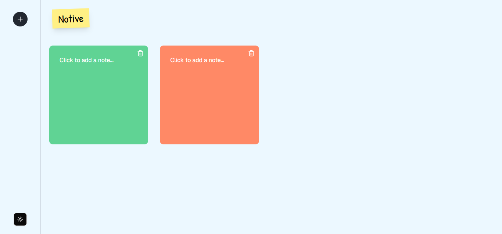

Perfect! Since your **Notive** app is live at `https://notive-active-notes.vercel.app/`, here’s your **final, copy-paste-ready `README.md`** — clean, professional, and tailored for GitHub.

---

## ✅ Final `README.md` for **Notive**

````markdown
# 📝 Notive

**Notive** is a minimal, distraction-free note-taking app built with **Next.js**, **Tailwind CSS**, **MongoDB**, **shadcn/ui**, and **Framer Motion**.  
It's fast, clean, and saves your notes automatically — organized by device ID.

🌐 **Live Demo:** 
[https://notive-active-notes.vercel.app]

---

## ✨ Features

- 🧠 Clean, distraction-free UI
- 💾 Auto-save notes per device (device ID–based)
- 🌙 Dark mode support
- 🎨 Built with shadcn/ui
- 🌀 Framer Motion transitions
- 📱 Responsive design
- ⚡ Fast & SEO-friendly via Next.js App Router

---

## 🛠 Tech Stack

| Frontend         | Backend             | Database |
|------------------|----------------------|----------|
| Next.js 14+      | Node.js API Routes   | MongoDB  |
| Tailwind CSS     | RESTful APIs         | Mongoose |
| shadcn/ui        |                      |          |
| Framer Motion    |                      |          |

---

## 🚀 Live Preview

🔗 [**Click here to try Notive live**]
(https://notive-active-notes.vercel.app)

---

## 📦 Installation

```bash
git clone https://github.com/yourusername/notive.git
cd notive
npm install
````

---

## ⚙️ Environment Setup

Create a `.env.local` file in the root:

```env
MONGODB_URL=your_mongodb_connection_string
```

---

## 🧱 Run Locally

```bash
npm run dev
```

The app will be running at: [http://localhost:3000](http://localhost:3000)

---

## 📁 Folder Structure

```
/app
/components
  ├─ homepage.tsx
  ├─ notes.tsx
/lib
  └─ db.ts
/models
  └─ Note.ts
/pages
  └─ api/notes.ts
/public
/styles
```

---

## 📦 Required Dependencies

Install these if they’re not already in your project:

```bash
npm install @shadcn/ui framer-motion lucide-react class-variance-authority tailwind-merge
```

Initialize shadcn/ui (if not already):

```bash
npx shadcn-ui@latest init
```

---

## 🔮 Upcoming Features

* 🔍 Tags and search
* 🧾 Markdown support
* 🧠 AI summaries (optional)
* 📲 PWA support for offline notes
* 🧑‍💻 User auth with cross-device sync

---

## 📸 Screenshots

<!-- Add image to `/public/notive-preview.png` if you have one -->



---

## 👨‍💻 Author

Made with ❤️ by [Pranay Gurav](https://github.com/cwpranay)

---


## 🙏 Acknowledgements

* [Next.js](https://nextjs.org/)
* [Tailwind CSS](https://tailwindcss.com/)
* [shadcn/ui](https://ui.shadcn.com/)
* [Framer Motion](https://www.framer.com/motion/)
* [MongoDB](https://www.mongodb.com/)


